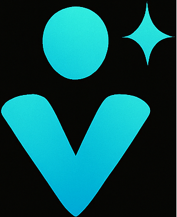

<p align="center">
  
</p>

<h1 align="center">Vega Design Studio</h1>

<p align="center">
  <strong>A full-stack portfolio and business platform built with Next.js 15, TypeScript, and Tailwind CSS 4.</strong><br/>
  Design intelligence meets modern web engineering — live at <a href="https://vegadesign.studio">vegadesign.studio</a>
</p>

<p align="center">
  
  
  
  
  
</p>

---

## Why This Project Exists

This is not a template — it is the **production website** for my design studio, built entirely from scratch and eventually enhanced with AI-driven design intelligence and automation to serve as both a client-facing business platform and a showcase of my engineering approach. Every architectural decision was made with real constraints: SEO performance in the competitive Los Angeles market, sub-second load times for client acquisition, and a design system that scales across multiple service verticals.

## Technical Highlights

### Architecture & Performance

| Metric | Value |
|---|---|
| **Framework** | Next.js 15.5 (App Router, Turbopack) |
| **Language** | TypeScript 6 — strict interfaces across 28 source files |
| **Styling** | Tailwind CSS 4 + custom CSS design token system (20+ tokens) |
| **First Load JS** | ~102 KB shared bundle (automatic code splitting) |
| **Static Routes** | 7 pages pre-rendered at build time |
| **Dynamic Routes** | 3 server-rendered on demand (case studies, OG images, API) |

### Engineering Decisions Worth Noting

**Type-Driven Data Architecture** — All portfolio content is governed by TypeScript interfaces (`Brand`, `Project`) exported from a single source of truth ([`information.ts`](app/information.ts)). This means the sitemap, OG images, case study pages, and portfolio grid all derive from the same typed data — zero duplication, zero drift.

**Server/Client Component Boundary** — The app defaults to React Server Components. Client interactivity is surgically isolated to only the components that need it: `NavBar` (mobile menu toggle), `Chatbot` (stateful conversation), `BeforeAfter` (slider interaction), and `WorkIndex` (filter state). This keeps the JS bundle minimal while maintaining rich UX.

**Automated Lead Pipeline** — The `/api/lead` route handles a multi-step qualification flow: validates email input, dispatches internal notifications via Resend (with SMTP fallback via Nodemailer), and triggers a two-email auto-reply sequence including a calendar booking CTA — all type-safe with `NextRequest`/`NextResponse`.

**Dynamic OG Image Generation** — Each case study generates its own Open Graph image at the edge using `next/og`, pulling project title and tag from the typed data layer. No static image assets to maintain.

**Custom Design System** — Rather than relying solely on Tailwind utility classes, the project implements a CSS custom property system (`globals.css`) with:
  - Glassmorphism card primitives with backdrop blur and glow-on-hover
  - Animated gradient text shimmer (CSS `@keyframes` + `background-clip`)
  - Staggered entrance animations with configurable delays
  - `prefers-reduced-motion` media query for accessibility compliance

## Project Structure

```
app/
├── api/
│   ├── health/route.ts          # Edge runtime health check
│   └── lead/route.ts            # Lead qualification + email pipeline
├── components/
│   ├── NavBar.tsx                # Responsive nav with mobile drawer
│   ├── Hero.tsx                  # Landing section with ambient glow
│   ├── Services.tsx              # Service grid with typed items
│   ├── Pricing.tsx               # Tiered pricing with featured highlight
│   ├── Process.tsx               # Numbered workflow steps
│   ├── Portfolio.tsx             # Project cards from typed data
│   ├── About.tsx                 # Values, capabilities, tech stack
│   ├── Contact.tsx               # Form + booking CTA
│   ├── Chatbot.tsx               # Stateful AI chat widget
│   ├── Footer.tsx                # Brand links + contact info
│   ├── CaseSummary.tsx           # Reusable case study summary
│   └── JsonLd.tsx                # Security-hardened structured data
├── ui/
│   ├── elements.tsx              # Container, Section, Card, CallToAction
│   └── BeforeAfter.tsx           # Image comparison slider
├── work/
│   ├── page.tsx                  # Filterable portfolio index
│   └── [slug]/
│       ├── page.tsx              # Dynamic case study with sidebar CTA
│       └── opengraph-image.tsx   # Edge-generated OG images
├── about/page.tsx
├── contact/page.tsx
├── services/page.tsx
├── information.ts                # Typed data layer (Brand + Project[])
├── sitemap.ts                    # Dynamic sitemap from typed data
├── layout.tsx                    # Root layout with JSON-LD Organization
├── error.tsx                     # Error boundary
├── not-found.tsx                 # 404 page
├── page.tsx                      # Home page composition
└── globals.css                   # Design token system + animations
```

## SEO & Structured Data

- **Organization JSON-LD** injected in the root layout
- **Service JSON-LD** with `OfferCatalog` on `/services`
- **AboutPage JSON-LD** on `/about`
- **Dynamic `<meta>` and Open Graph** per case study page via `generateMetadata`
- **Programmatic sitemap** (`sitemap.ts`) auto-generates URLs from the project data array
- **Proper heading hierarchy** (`h1` → `h2` → `h3`) on every page

## Local Development

```bash
# Install dependencies
npm install

# Start dev server (Turbopack)
npm run dev

# Production build
npm run build

# Start production server
npm start
```

### Environment Variables

| Variable | Purpose |
|---|---|
| `OPENAI_API_KEY` | Powers the AI chatbot (health check endpoint) |
| `RESEND_API_KEY` | Primary email delivery for lead pipeline |
| `SMTP_HOST`, `SMTP_PORT`, `SMTP_USER`, `SMTP_PASS` | Fallback email delivery |
| `STUDIO_EMAIL` | Internal notification recipient |
| `BOOKING_LINK` | Google Calendar scheduling URL |

## Portfolio Projects

This site showcases four production client projects, each with dedicated case study pages:

| Project | Stack | Key Achievement |
|---|---|---|
| **[Adelphos Manila](https://threadbearer.github.io/AdelphosManila/)** | HTML5, CSS3, Vanilla JS, Google Apps Script | Zero-dependency e-commerce under 60KB |
| **[Montalvo's Pure Water](https://threadbearer.github.io/MPWater/)** | HTML5, CSS3, Vanilla JS, JSON-LD | 91% code reduction (580KB → 47KB) |
| **[JSP Construction](https://threadbearer.github.io/JSPConstruction/)** | HTML5, CSS3, Vanilla JS, Formspree, GCP | 119 design tokens, full WCAG accessibility |
| **[GR Counseling](https://threadbearer.github.io/GRCounseling/)** | Next.js, React, SCSS, Google Cloud | 15+ page healthcare platform with SSR |

## Tech Stack

| Layer | Technology |
|---|---|
| **Framework** | Next.js 15 (App Router) |
| **Language** | TypeScript 6 |
| **UI** | React 18, Tailwind CSS 4 |
| **Email** | Resend, Nodemailer |
| **AI** | Vercel AI SDK, OpenAI |
| **Analytics** | Vercel Analytics |
| **Hosting** | Vercel (Edge + Serverless) |
| **Fonts** | Google Fonts (Outfit, Inter) |

## Design Philosophy

The visual language follows what I call **"Dark Minimalist Luxury"** — a design system built around three principles:

1. **Contrast-driven hierarchy** — Cyan-to-blue gradients on jet-black backgrounds create instant visual anchors without color noise
2. **Glassmorphism as depth** — Semi-transparent cards with backdrop blur create layered dimensionality that feels premium without being heavy
3. **Motion as communication** — Staggered fade-up animations, gradient shimmer on brand text, and hover-lift on cards all serve functional purposes (guiding attention, confirming interactivity)

---

<p align="center">
  <strong>Jacob Legorreta</strong><br/>
  Full-Stack Web Developer · Los Angeles, CA<br/><br/>
  <a href="https://vegadesign.studio">vegadesign.studio</a> · 
  <a href="https://github.com/threadbearer">github.com/threadbearer</a> · 
  <a href="mailto:jlegorreta@vegadesign.studio">jlegorreta@vegadesign.studio</a>
</p>